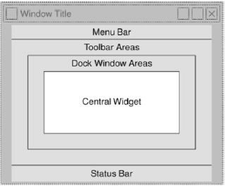

# Py-GUI

using PyQt5

**To Install**

```
pip install PyQt5
```
## Tructure of a table

A GUI based application's top level window is created by **QMainWindow** widget object




## Make py GUI table

Make GUI as a table to communicate 

[Test](./GUI_table.py)